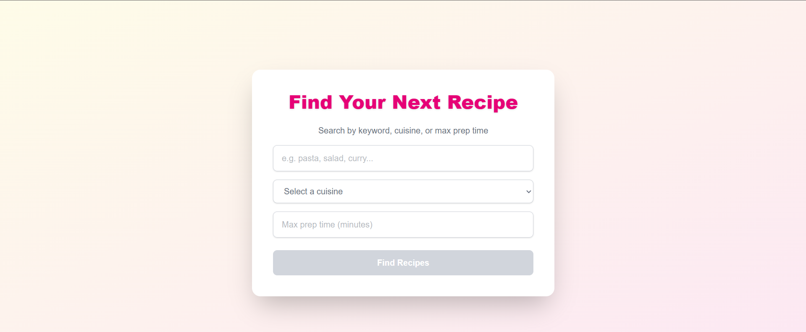
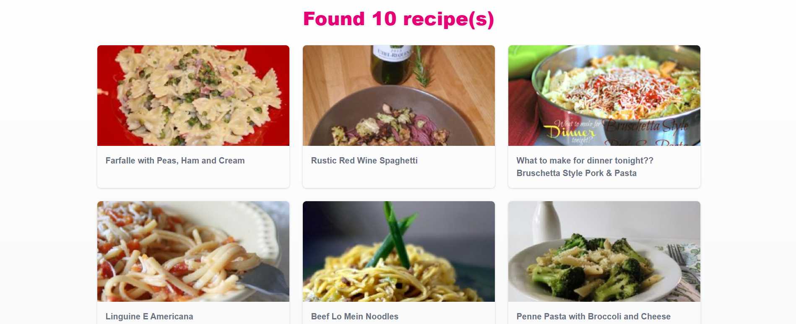
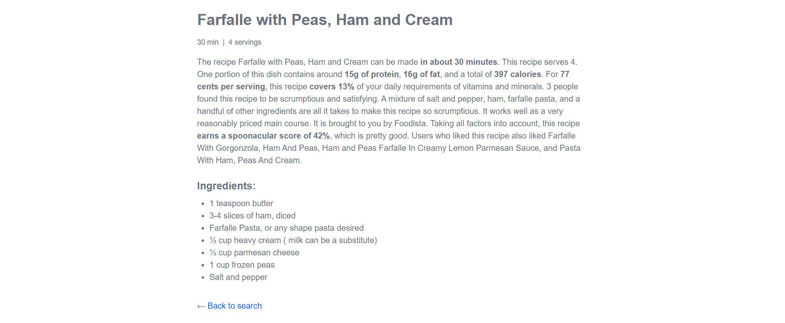

# 🍽 Recipe Finder App

A modern recipe search application built with **Next.js 14**, **Tailwind CSS**, and the **Spoonacular API**.  
Users can search for recipes using filters and view detailed information for each recipe.

---

## ✨ Features

- 🔎 Search recipes by:
  - Keyword (e.g. "pasta")
  - Cuisine (Italian, Mexican, Chinese)
  - Max preparation time (in minutes)
- 🧠 "Next" button is only active when at least one filter is filled
- 📄 Server-side or client-side rendering of results
- 🖼 Recipe list with title and image
- 📘 Recipe details page with ingredients, time, servings, and summary
- ⏳ API response caching (60s)
- 🧱 Responsive and accessible UI with Tailwind CSS
- ✅ ESLint and Prettier configured
- 🔁 Uses React Suspense and loading fallback
- ❌ Error handling and "no results" states

---

## 📸 Screenshots

| Search Page                        | Recipe List                         | Recipe Details                      |
| ---------------------------------- | ----------------------------------- | ----------------------------------- |
|  |  |  |

---

## 🧑‍💻 Getting Started

### 1. Clone the repository

```bash
git clone https://github.com/YOUR_USERNAME/recipe-finder-app.git
cd recipe-finder-app
```

### 2. Install dependencies

```bash
npm install
```

### 3. Setup environment variables

Create `.env.local`:

```env
NEXT_PUBLIC_SPOONACULAR_API_KEY=your_actual_api_key_here
```

You can get a free API key at [Spoonacular API](https://spoonacular.com/food-api/docs#Authentication)

### 4. Run development server

```bash
npm run dev
```

App will be available at: [http://localhost:3000](http://localhost:3000)

---

## 🧰 Scripts

| Command          | Description               |
| ---------------- | ------------------------- |
| `npm run dev`    | Run development server    |
| `npm run build`  | Build app for production  |
| `npm run start`  | Start production build    |
| `npm run lint`   | Run ESLint                |
| `npm run format` | Format code with Prettier |

---

## 🛠 Technologies Used

- [Next.js 14 (App Router)](https://nextjs.org/)
- [Tailwind CSS](https://tailwindcss.com/)
- [Spoonacular API](https://spoonacular.com/food-api)
- [React Suspense](https://react.dev/reference/react/Suspense)
- [ESLint](https://eslint.org/)
- [Prettier](https://prettier.io/)

---

## 📦 Folder Structure

```
src/
├── app/
│   ├── page.tsx                # Search page
│   ├── recipes/
│   │   ├── page.tsx            # Recipes page wrapper
│   │   ├── recipe-list.tsx     # Recipe grid
│   │   ├── recipes-client.tsx  # Recipes client logic
│   │   └── [id]/
│   │       ├── page.tsx        # Recipe details wrapper
│   │       └── recipe-client.tsx # Detail fetch & render
```

---

## 📤 Deployment

This project can be deployed via [**Vercel**](https://vercel.com):

1. Push to GitHub
2. Import repo to Vercel
3. Set `NEXT_PUBLIC_SPOONACULAR_API_KEY` in Vercel’s environment variables
4. Click **Deploy**

---

## 📋 Notes

- Free tier of Spoonacular API allows up to 150 requests per day.
- The application uses client-side fetching to avoid limitations with Next.js dynamic routing in SSR.
- Styled with Tailwind and optimized for all screen sizes.

---

## 🙋 About

This project was completed as part of a **Front-End Engineer technical assessment**.  
Created in 2025 by Dmytro Menzak.
